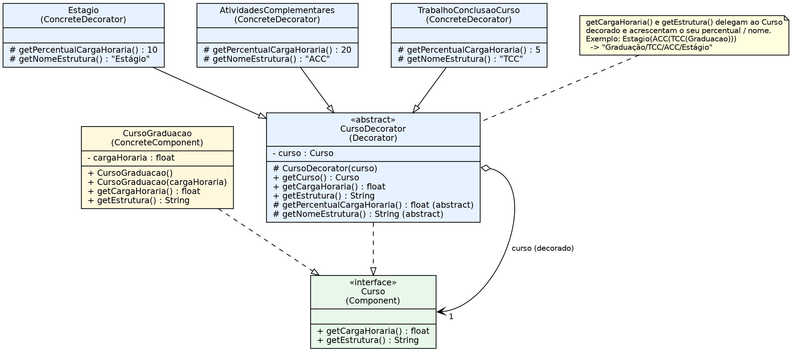

# Padrão Decorator — Estrutura e Carga Horária de Cursos

## Estrutura do padrão
| Papel | Classe |
|---|---|
| Component | `Curso` (interface) |
| ConcreteComponent | `CursoGraduacao` |
| Decorator | `CursoDecorator` (abstrata, Template Method) |
| ConcreteDecorator | `Estagio` (+10%), `AtividadesComplementares` (+20%), `TrabalhoConclusaoCurso` (+5%) |

## Diagrama UML


## Correções aplicadas
1. **`AtividadesComplementares`**: `package padrao-decorator;` (inválido, hífen não é permitido) → `padroesestruturais.decorator`. Era erro de compilação.
2. **`CursoDecorator`**: removidos o campo público `estrutura` e `setEstrutura()` (código morto, nunca lido, quebrava o encapsulamento).
3. **`CursoDecorator`**: `curso` agora é `final` (sem `setCurso`), pois trocar o componente decorado depois de criado não faz parte do padrão e permitia estado inconsistente.
4. **`CursoDecorator`**: construtor rejeita `null` (`Objects.requireNonNull`), evitando `NullPointerException` tardio em `getCargaHoraria()`.
5. **`CursoDecorator`**: ganchos `getPercentualCargaHoraria()` e `getNomeEstrutura()` e o construtor passaram a `protected` (detalhe de implementação do Template Method); `@Override` adicionado em todos os métodos.
6. **`CursoGraduacao`**: campo `cargaHoraria` público → `private final`.

## Observação de projeto (não alterada)
Os percentuais são **compostos** (cada decorador aplica seu percentual sobre o valor já acumulado), como os testes originais esperam (1000 → 1386). Por isso a ordem não altera a carga horária (multiplicação é comutativa), mas altera a string da estrutura. Se a regra de negócio for percentual sobre a carga *base*, a fórmula deve ser aditiva.
Também se usa `float`; para valores monetários ou contábeis prefira `BigDecimal`. Para cargas horárias, `float` com `delta` nos testes é suficiente.

## Executar
```
mvn test
mvn compile exec:java -Dexec.mainClass=padroesestruturais.decorator.Main
```
Requer JDK 11+ e Maven.

## Testes
- `CursoTest`: os 16 testes originais (inalterados).
- `CursoDecoratorTest`: 10 testes novos (null, `getCurso`, imutabilidade do componente, mesmo decorador duas vezes, ordem, carga zerada, percentuais, independência).
